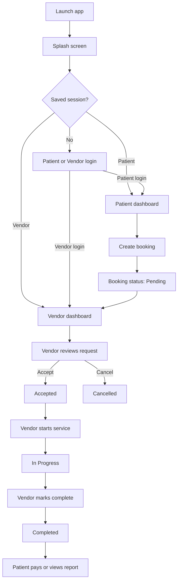

# Injection

Injection is a React Native healthcare services application for patients and healthcare vendors. Patients can discover services, submit appointment requests, manage bookings, make payments, track service progress, and access reports. Vendors can manage their profile, request services, activate their offerings, and process patient bookings from request through completion.

## Contents

- [Product Overview](#product-overview)
- [Roles and Capabilities](#roles-and-capabilities)
- [Application Flow](#application-flow)
- [Booking Lifecycle](#booking-lifecycle)
- [Vendor Workflow](#vendor-workflow)
- [Prerequisites](#prerequisites)
- [Installation](#installation)
- [Configuration](#configuration)
- [Running the Application](#running-the-application)
- [Project Structure](#project-structure)
- [Testing and Code Quality](#testing-and-code-quality)
- [Troubleshooting](#troubleshooting)

## Product Overview

Injection provides two authenticated experiences in one mobile application:

- **Patient experience**: Dashboard, booking creation, booking history, payment, appointment details, route viewing, notifications, profile management, insurance information, and reports.
- **Vendor experience**: Dashboard, booking queue, booking detail, service catalog, service requests, activation controls, profile management, runtime notes, and route viewing.

The application uses role-aware navigation. A saved session is restored during the splash screen, and the user is sent directly to the appropriate dashboard.

## Roles and Capabilities

### Patient

Patients can:

1. Register or sign in with email and password.
2. Browse available healthcare services.
3. Create a booking for themselves or a family member.
4. Provide patient details, location, contact information, requirements, insurance, documents, preferred schedule, staff preference, and a complimentary service.
5. Review the calculated charges before submitting the request.
6. Track booking status from the Bookings tab.
7. Open booking details to view the vendor, schedule, location, selected services, payment, requested items, notes, and reports.
8. Reschedule or cancel a booking when supported by the current booking state.
9. Pay an eligible booking using cash or Razorpay.
10. Receive foreground and push notification updates.

### Vendor

Vendors can:

1. Register with contact, business, location, service, professional, banking, profile, and document information.
2. Sign in using the Vendor login option.
3. View booking requests assigned to the vendor.
4. Inspect complete patient, service, schedule, location, payment, and requirement details.
5. Accept or cancel pending bookings.
6. Start an accepted booking and mark an in-progress booking as complete.
7. Add runtime notes during service delivery.
8. View the patient route on a map when location data is available.
9. Request additional services from the service catalog.
10. Monitor service request status and activate or deactivate available vendor services.

## Application Flow



### Launch and session restoration

1. The app opens on the animated Splash screen.
2. The authentication store loads the saved session from device storage.
3. Authenticated patients are routed to `UserTab > Dashboard`.
4. Authenticated vendors are routed to `VendorTab > Dashboard`.
5. Without a saved session, the app opens the email login screen.
6. After a successful login, the app stores the user, role, and token locally. Notification permission and device registration are also attempted.

### Patient navigation

The patient tab bar contains:

- **Dashboard**: Entry point for available healthcare features.
- **Bookings**: Booking history, filters, statuses, payment state, reports, and booking details.
- **Profile**: Patient profile and account management.

Additional stack screens support booking creation, booking detail, booking maps, notifications, profile editing, order tracking, and vendor ID cards.

### Vendor navigation

The vendor tab bar contains:

- **Dashboard**: Vendor overview and operational entry point.
- **Bookings**: Booking queue, status filters, refresh, and workflow actions.
- **Services**: Active services, service requests, activation controls, and service catalog requests.
- **Profile**: Vendor account and business profile management.

## Booking Lifecycle

### Creating a booking

From the patient dashboard, open the booking flow. The form contains six steps:

1. **Basic Details**
   - Patient name, age, sex, address or current location, pincode, phone numbers, and email.
   - The form can start with values from the saved patient profile.
   - Location permissions may be required when using the current location option.

2. **Select Services**
   - Select one or more services.
   - Set quantities where applicable.

3. **Requirements**
   - Add additional instructions.
   - Upload a prescription or supporting document/image.
   - Provide insurance details when insurance is selected.

4. **Select Slots**
   - Select the preferred date and time.
   - Choose staff preference: Any Available, Male Staff, or Female Staff.

5. **Review and Charges**
   - Review selected services and charges.
   - The app calculates the subtotal, 18% GST, and grand total before submission.

6. **Complimentary Service**
   - Select an available complimentary service, such as Blood Sugar, Blood Group, or Haemoglobin, or choose None.
   - Review the appointment summary and confirm.

The app validates each step before allowing the patient to continue. On confirmation, the booking is submitted to the backend with status `pending`. A successful submission returns the patient to the previous screen and displays the appointment confirmation.

### Editing a booking

When an existing booking is opened for editing, the same multi-step form is pre-filled with the saved data. Submitting the form updates the existing booking while preserving its current status unless the backend applies a different business rule.

### Booking statuses

| Status | Meaning | Primary owner |
| --- | --- | --- |
| `pending` | Booking has been submitted and is waiting for vendor action. | Vendor |
| `accepted` | Vendor accepted the booking. | Vendor / Patient |
| `in-progress` | Vendor started the appointment or service. | Vendor |
| `completed` | Vendor marked the service as finished. | Vendor |
| `cancelled` | Booking was cancelled by an authorized action. | Vendor / Patient |

The patient and vendor booking lists provide filters for each status. Pull-to-refresh reloads the latest server state.

### Vendor confirmation and service execution

1. The vendor opens **Bookings** and reviews pending requests.
2. The vendor opens a request to inspect patient details, selected services, preferred slot, service address, requirements, insurance information, and payment information.
3. The vendor selects **Accept** to call the booking acceptance endpoint. The booking moves to `accepted` and the patient can see the updated state.
4. If the request cannot be fulfilled, the vendor selects **Cancel** instead.
5. For an accepted booking, the vendor selects **Start Service**. The booking moves to `in-progress`.
6. During delivery, the vendor can add runtime notes and use the map route when coordinates are available.
7. When the work is finished, the vendor selects **Mark Complete**. The booking moves to `completed`.
8. The patient can then review payment state and available reports from booking details.

### Payments

The patient booking list displays a payment action when the booking is `accepted`, `in-progress`, or `completed` and the payment is not yet marked as paid. The supported methods are:

- **Cash**: Select cash in the payment flow and close the payment prompt.
- **Razorpay**: Complete the Razorpay payment and verify it through the backend before the booking is considered paid.

Payment states are `pending`, `paid`, and `failed`. The final amount can include the booking total and any additional amount returned by the backend.

### Rescheduling, cancellation, and reports

- **Reschedule**: Provide a future date in `YYYY-MM-DD` format, a time in `HH:MM` 24-hour format, and a reason of at least five characters.
- **Cancellation**: Confirm the cancellation prompt. The backend records the cancellation and the booking appears under the `cancelled` filter.
- **Reports**: Completed bookings can expose an uploaded report or report list in booking details. Reports may be categorized as lab, imaging, general, or other.
- **Notifications**: The app registers a device token after login when notification permission is granted. Tapping a foreground notification opens the Notifications screen.

## Vendor Workflow

### Vendor registration

Vendor registration is a four-step process:

1. **Contact and Business**: Name, email, phone, password, and business name.
2. **Location and Services**: Address, city, state, pincode, offered services, service areas, and coordinates.
3. **Professional Information**: Business and professional details.
4. **Bank and Documents**: Bank information, profile image, and supporting documents.

Required checks include a valid email, ten-digit phone number, password confirmation, business name, complete address, six-digit pincode, at least one service, and a profile image. New vendor accounts are submitted for administrative activation and return to the login screen after successful registration.

### Managing vendor services

Open **Services** to view the vendor's services and their active/inactive state.

- Use **Request** to choose services from the catalog and submit a service request.
- Open **Service Requests** to see `pending`, `approved`, or `rejected` requests.
- Approved services appear in the vendor service list.
- Use **Activate** or **Deactivate** to control whether a service is available for operations.
- Pull down to refresh either the service list or request list.

## Prerequisites

### General

- Node.js `>= 22.11.0`
- npm or Yarn
- Git

### Android

- Android Studio and Android SDK
- JDK 11 or newer
- Android SDK API level 21 or newer
- An emulator or a connected Android device

### iOS

- macOS 12 or newer
- Xcode 14 or newer
- CocoaPods
- Ruby 2.7 or newer
- An iOS Simulator or connected iOS device

## Installation

```bash
git clone <repository-url>
cd Injection
npm install
```

For iOS, install Ruby and CocoaPods dependencies:

```bash
bundle install
bundle exec pod install
```

For Android, confirm that the Android SDK path is configured in `android/local.properties` when Android Studio has not configured it automatically.

## Configuration

The application uses the API client configuration in `src/config/env.ts` and `src/service/apiClient.ts`. Configure the backend URL and any environment-specific values required by the local or deployed API before running the application.

The app also expects platform configuration for Firebase notifications. Android Firebase configuration is stored in `android/app/google-services.json`. iOS notification configuration must be completed in Xcode and the Apple Developer account before push notifications can work on iOS.

Do not commit production credentials, signing keys, API secrets, or private certificates.

## Running the Application

### 1. Start Metro

From the repository root:

```bash
npm start
```

To clear Metro's cache:

```bash
npm start -- --reset-cache
```

### 2. Run Android

Start an emulator or connect a device, then run:

```bash
npm run android
```

### 3. Run iOS

On macOS, after installing pods:

```bash
npm run ios
```

### 4. First-use walkthrough

After the app opens:

1. Select **Patient** or **Vendor** on the login screen.
2. Sign in with an existing account, or use the registration flow for a new account.
3. For a patient, open the dashboard and create a booking using the six-step flow above.
4. For a vendor, open **Bookings**, review the pending request, and process it through accept, start, and complete.
5. Return to the patient account to verify status changes, payment state, notifications, and reports.

## Project Structure

```text
Injection/
├── App.tsx                         # Root component and safe-area setup
├── src/
│   ├── components/                 # Shared UI components
│   ├── context/                    # Alert and application context
│   ├── features/
│   │   ├── auth/                   # Patient and vendor authentication
│   │   ├── booking/                # Booking forms, lists, details, and maps
│   │   ├── dashboard/              # Patient and vendor dashboards
│   │   ├── notification/           # Notification screens and services
│   │   ├── profile/                # Patient and vendor profiles
│   │   └── vendorService/          # Vendor service catalog and requests
│   ├── navigation/                 # Stack and role-specific tab navigators
│   ├── service/                    # API client and API modules
│   ├── store/                      # Zustand authentication store
│   ├── theme/                      # Colors, map styling, and design tokens
│   ├── types/                      # Shared TypeScript models
│   └── utils/                      # Location, directions, documents, and notifications
├── android/                        # Android native project
├── ios/                            # iOS native project
├── __tests__/                      # Jest tests
├── package.json                    # Scripts and dependencies
└── README.md
```

## Testing and Code Quality

Run the Jest test suite:

```bash
npm test
```

Run a single test file:

```bash
npm test -- App.test.tsx
```

Run linting:

```bash
npm run lint
```

Run the TypeScript compiler without emitting files:

```bash
npx tsc --noEmit
```

Format source files with Prettier when needed:

```bash
npx prettier --write src/
```

## Troubleshooting

### Metro or bundling errors

```bash
npm start -- --reset-cache
```

If the dependency tree is inconsistent, remove `node_modules` and reinstall using the package manager used by the project.

### Android build errors

```bash
cd android
gradlew clean
gradlew assembleDebug
```

Check that `android/local.properties` points to a valid Android SDK and that the selected device meets the minimum API level.

### iOS dependency errors

```bash
cd ios
bundle exec pod install --repo-update
```

Then rebuild from Xcode or run `npm run ios` again.

### API or login errors

- Confirm the API base URL in the application configuration.
- Confirm that the backend is reachable from the emulator or device, not only from the development machine.
- For Android emulators, use the host address required by the backend setup instead of assuming `localhost` refers to the development machine.
- Verify that the selected login role matches the account type.

### Location, maps, or notifications do not work

- Grant location permission and enable device location services.
- Confirm that coordinates are available for the booking or vendor address.
- Confirm Firebase and platform notification configuration.
- Reinstall the app after changing native permissions or notification configuration.

## License

This project is proprietary software. All rights reserved.
